# Motivation
Why is there a huge variation among large businesses' political spending?
* Do the ideological biases of users (corporate boards and donors) constrain the giving of corporate PACs?
    * Amount of PAC's spending
    * Recipients of PAC's spending
    
# Existing findings and theories
* Internal constraints as donors' partisanship can affect the group's activities. (Li 2018)
* Ideological heterogeneity within and across boardrooms (Bonica 2016)


# Types of PACs and corporate PACs’ moderate contribution profile
most PACs have centrist tendencies in terms of their contribution profile. Furthermore, single issue groups, partisan groups (such as Trump Victory PAC) and labor groups are exceptions in that they are highly partisan PACs. However, at first, as Figure below shows, most PACs are owned by businesses. Therefore, not surprisingly, major portions of money in campaign finance are from the business-oriented PACs as Figure belows right panel shows.
<p align="center">
  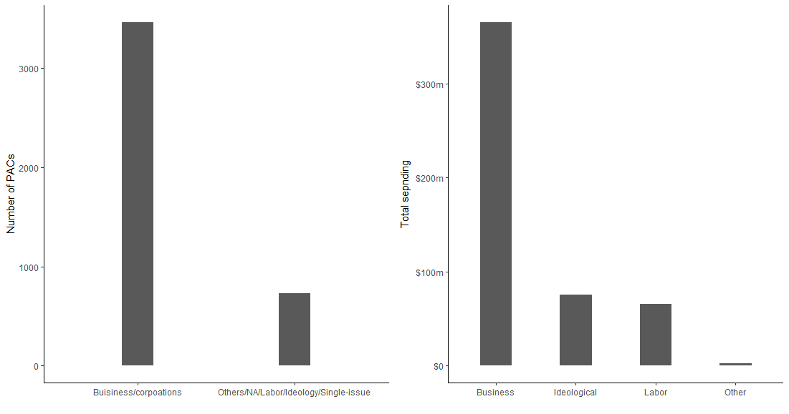
</p>

Business/corporation PACs spend their money about half on Republican and half on Democrat candidates. Yet, overall business PACs' contribution profiles are slightly more conservative. Therefore, PACs are understood to be moderate because business PACs dominate both the amount of spending and quantity of PACs. As a result, I argue that business PACs drive the moderate profile seen in PAC contributions. As the below figure shows, this moderate ideological profile of corporate PACs are observed in every sectors. The benchmark for comparison of ideological districution is the ideological distribution in the U.S. Congress.

<p align="center">
  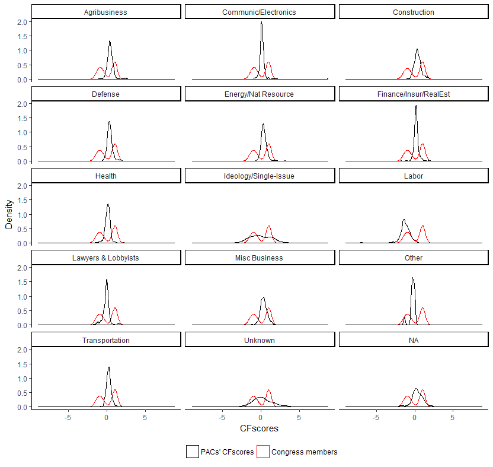
</p>


# Theory and hypothesis
* Theory:  Ideological diversity in boardroom can constrain corporate PAC's spending because leaders check and balance group's behaviors with limited resources. 
* Hypothesis: As ideological diversity within boardroom increases,  political spending of interest group's PAC decreases.

# Data
Fortune 500 companies as of 2012

* Independent variables (Bonica 2016)
  * The variance of board directors’ ideologies within a company (CFscore)
  * The mean of board directors’ ideologies by a company 
  * The proportion of female board directors within a company 
  * Sector of a company

<p align="center">
  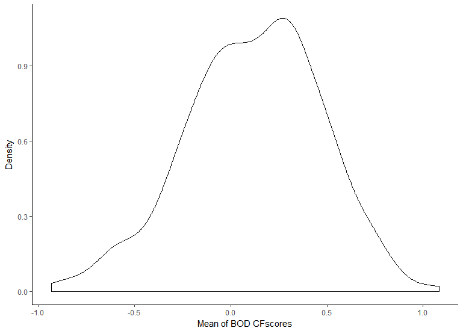
  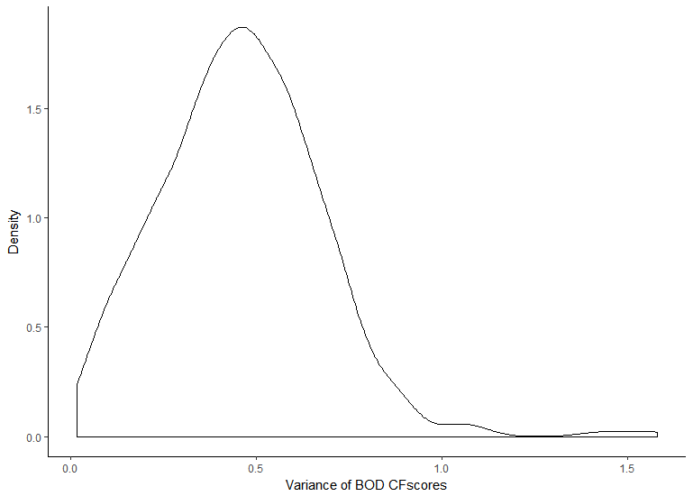
</p>


* Dependent variable (FEC)
  * Corporate PACs’ spending (total disbursement)

Figure 4 shows that the data are highly skewed to the right near zero because many firms do not have PACs and/or spend nothing in the 2012 election cycle. The mean amount of spending among the companies that made any contribution is about $590,000 and the median is $283,000. 

<p align="center">
  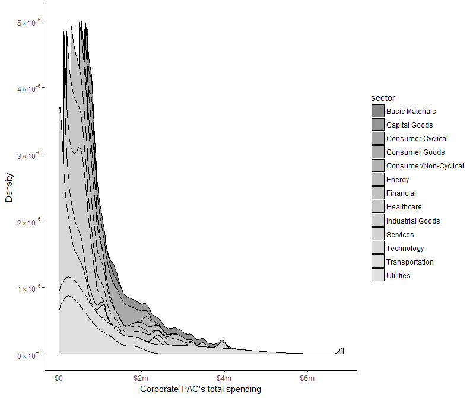
</p>


# Method: quantitative model and anedotes (qaulitative case study)

Now I will explain the model that I used to examine the relationship between ideological homogeneity of board directors within a firm and the corporate PACs' political spending. At first, from the data section, I learn that there is over-dispersion in corporate PACs' spending (dependent variable) in that it is skewed to the right. This pattern is observed from overall data and all the different sectors. Therefore, this pattern is not driven by one sector as we can see in Figure 7. Also the variance (553139) exceeds the mean (417) of the data (amount of spending binned by $1000). In these given conditions, negative binomial regression model is useful. In Boinca's paper, he puts raw dollars into bins of $1000 intervals (such as $0 to $1000) to make count data, I used the same bin to make count variable as dependent variable for negative binomial regression model (Unit of analysis: firm) (2016). Therefore, by using negative binomial regression, I can examine whether ideological biases of corporate boards constrain the giving of corporate PACs.


I will also provide several anecdotes to explain the relationship among various actors in corporate political spending, and why ideological diversity in boardrooms can constrain the amount and pattern of corporate PACs. The anecdotes are explained with following analysis. At first, I will explain why corporate PAC's ideology is distinctive compared to the Congress and its board directors. Then, I will show the money-weighted CFscores of corporate PAC's money recipients to explain how that is related to corporate PAC's CFscores. Lastly, I will compare corporate PAC donors' ideologies, board directors' ideologies and corporate PAC's ideological profile. Then, I will discuss distinctive characteristics of corporate elites and corporate PACs' ideology. 


# Main results
The results from negative binomial model are in Table 2. The result shows that higher the variance of board directors within a company, the corporate PAC spends less money in politics. It means one unit increases in the variance of board directors' CFscores, about log of 1.07 binned dollar decreases in the corporate PAC's spending. In other words, if boardroom is more ideologically homogeneous, the corporation spends more money as a PAC. The result also shows that higher proportion of female in boardroom, the PAC spends more. It means that every one unit increase in the proportion of female in boardroom, there is about log of 0.04 binned dollar increase in the corporate PAC spending. Model 2 in Table 2 which is without the categorical variable, sector, also shows almost the same results.


<p align="center">
  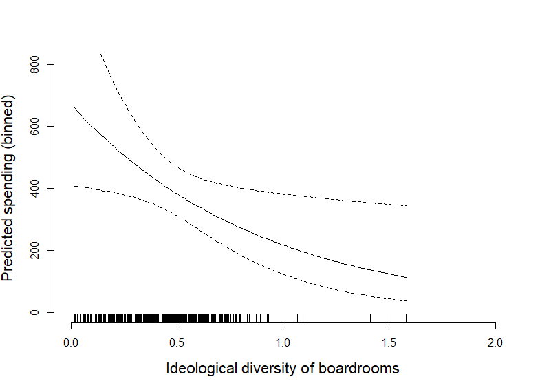
</p>

As Table 2's model 1 shows, to compare differences among different sectors, I set the reference group as Energy sector because it has a high mean value among sectors. The categorical variable as sector shows that the expected difference between energy and basic material sector is about log of 1.22 binned dollar and the difference between energy and consumer cyclical sector is about log of 1.76 binned dollar. It means that expected spending of energy sector companies are larger than basic material and consumer cyclical sectors. Model 2's results can be better explained by Figure 8. Figure 8 shows the expected spending of corporate PACs with 95 percent confident intervals. When there is an interquartile range change in boardroom diversity, we expect to see about 100 binned dollar difference. For instance, if a Intel Group's boardroom (0.590; 3rd quartile) is ideologically homogeneous as close to Goldman Sachs Group's boardroom (0.318; 1st quartile), Intel Group's PAC could have spent about \$100k (about 100 binned dollar difference) more in politics.


The main finding shows that ideological homogeneity in boardroom is positively related to corporate PAC's spending. Although at this point, with the observational data, it is difficult to claim there is a causal relationship between ideological homogeneity and PAC's spending, the finding is important in that ideological homogeneity of group's elites is related to the group's collective behavior. Also there are several interesting points regarding heterogeneity within groups in case of corporate PAC. 


# Partisan boardrooms and moderate corporate PACs}
As Figure 9 shows, in 2012, Congress was clearly partisan. Overall board directors of Fortune 500 companies follow the partisanship in Congress but leaning toward Republicans. However, corporate PACs' ideological profile based on campaign contribution (CFscores) is concentrated in the middle near zero. This ideological profile is clearly different from board directors as well as Congress. Bonica (2013) argues that because interest groups such as corporate PACs' CFscores can be inaccurate or misleading because they spend money strategically not sincerely. The major concern of CFscores for interest groups is in strategic giving. However, rather CFscores of corporate PACs clearly show that these groups spend money strategically moderate.

As Bonica (2016) found, it is surprising because board directors who are the final decision makers of corporate PACs are partisan overall, but the group, corporate PAC itself shows substantially different ideologies from board directors' ideologies. Then, is this same for all corporate PACs? To examine this question, I need to check the distribution of ideology in board directors of each firms.


<p align="center">
  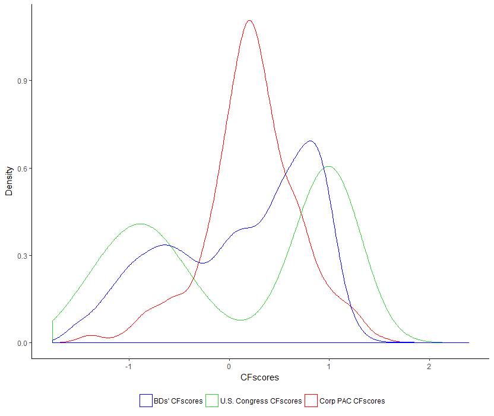
</p>


Figure 10 presents 10 randomly selected companies out of all Fortune 500 companies. Overall, each company's boardroom is as Bonica (2016) showed, heterogeneous and specifically, each plot shows multiple peaks without single specific skew at an unique point of ideology. If there is no red or black density line, the corporate PAC does not spend money in 2012. Black and red density lines show that the distribution of corporate PAC's money recipients' CFscores are different from the distribution of money-weighted CFscores. The weighted CFscores are important because even if corporate PAC gives money to more conservative candidates or groups, the amount of money they spent can mainly go to liberal candidates and also my paper's analysis is only with 2012's spending of corporate PACs. In other words, black density line can be misleading unless we take the amount of money into account. For instance, let us think about the case of Targa resources, Targa resources in the Figure 9 shows this. The recipients of the PAC are mostly more conservative candidates or groups around CFscore, 1, but when we consider the amount of money by recipients, we can observe that the PAC gives large portion of money mainly to less conservative candidates who has CFscores around 0.5. One pattern from Figure 9 is after we weight the recipient’s CFscore by money, the density line of recipients moves closer to the middle. This pattern explains why corporate PACs' CFscores have moderate ideological standings that are in the middle.

%The figure 9 has many lines, so I will explain which line is what variable: blue density line is the density of BDs' CFscores. Red density line is corporate PAC's recipient's CFscores weighted by the amount of money. Black density line is not weighted corporate PAC’s recipient’s CFscores. Green vertical line is the mean of BD's CFscores. Purple vertical line is corporate PAC's CFscores. 


<p align="center">
  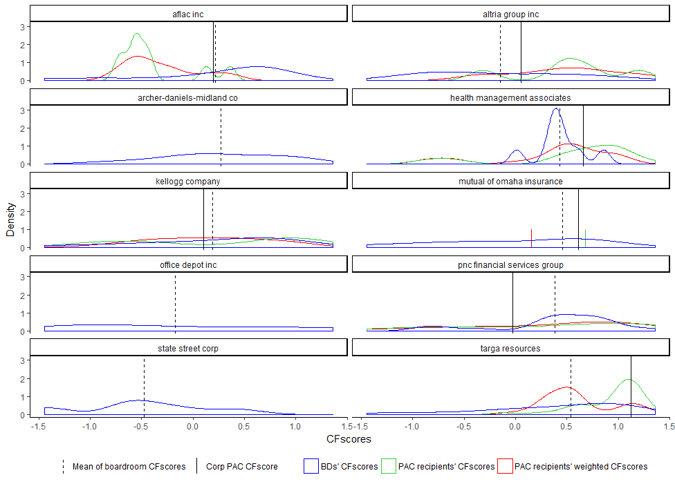
</p>


# Qualitative case study
There are largely three players that we have to consider in the process of PAC's political giving: donors, individual PAC elites and PAC elites as a leadership group. Findings of prior studies indicate that individual donors typically give their money to PACs as part of their consumer behavior and political expression (Ansolabehere, Figueiredo and Snyder 2003). In PACs, the PAC elites finally decide where the money goes from the PAC. The PAC elites who are the decision makers of PAC as a "group" give money strategically for the returns including gaining access to politicians or committees. The elites may consider their personal interests from the PAC's giving but they might be constrained by donors' ideologies and wants. Therefore, the interest group elites are constrained by donors in the process of deciding the recipients of PAC money as well as the amount of PAC spending. Moreover, a PAC does not operate by itself. There are various decision makers and elites who decide PACs' behavior collectively. Inside of group leadership, group's elites might consider other elite members' political preferences. Although donors are major members of a group by number, there are group elites who make final decisions for groups, and the elites might consider not only the donors but also other elite colleagues. Therefore, when we think about interest groups and their PACs, we should consider the elites of the groups. Based on the findings of this study, ideological homogeneity of elites within the group (board directors) is associated with the group's total spending. Extending Li's argument (2018), I suggest that a theory of internal constraints restricted by elite members of a group and that affect the behavior of the group. When corporate elites are ideologically homogeneous within a firm, they may not be constrained by other members' ideologies. Therefore, I expect the firm that has more ideologically homogeneous spends more campaign contribution than the less homogeneous firm.  

# The case of Google
Google is an interesting case to discuss because there is high discrepancy in ideology among donors, PAC, PAC money recipients and board directors. Li (2018) also well summarized the relationship between donors and board directors' ideologies of Google. Therefore, I extend the interesting case of Google. Figure 11 shows the distribution of ideological profiles of donors, board directors, PAC itself and the recipients. %Black density line is the distribution of Google donors' ideologies that match Bonica's DIME data. Orange density line is Google BD's ideology. Red vertical line is Google corporate PAC’s ideology and the purple density line is money weighted CFsocre of Google PAC recipients. 


<p align="center">
  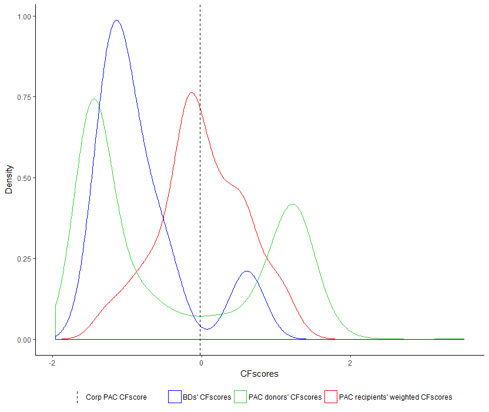
</p>

Figure 11 shows that Google boardroom is liberal overall in that they are left-leaning. Considering the mean Democrat CFscore is -0.89, Google's boardroom is indeed liberal. However, the donors of Google's PAC are clearly divided. On the other hand, money-weighted CFscores of Google PAC recipients (mostly candidates, committees or other PACs) are in the middle of the CFscore spectrum which means Google's PAC is moderate (a centrist), and this is close to the corporate PAC's CFscore. The distribution of donors is different from PAC itself in term of ideology. The results presented in this study can be explained by Li's theory about internal constraints in interest group from donors in that donors' ideologies constraint PACs' behavior by fund-raising (2018). However, in Li's picture, corporate elites are missing. In case of Google, corporate elites, the final decision makers of PAC's behaviors are left-leaning, liberal, and as a group, the Google boardroom is more ideologically homogeneous than its donors. 

# Are boardrooms ideologically heterogeneous? by nature or by design?
As I discussed, Google's boardroom is more ideologically homogeneous than its donors. In the work of Bonica (2016), he shows that boardrooms are heterogeneous within and across firms. Moreover, he argues that there are two possible scenarios that explain ideological heterogeneity within a company: the first is it is because board directors are selected unrelated to their ideologies (by nature), and the second is it is by design by shareholders and other members who participate in the selection of board directors. Bonica (2016) argues that there is no evidence that board directors' heterogeneity within a company is designed to be "ideologically" diverse, so the first scenario is more plausible. Indeed, there is little literature that explains or studies ideological diversity within boardroom, and the process of selecting board directors in light of their ideologies is like a black box to researchers. However, there are many studies regarding boardroom diversity in other various aspects. Although some studies show that it is inconclusive to argue boardroom diversity is positively related to corporate performance or governance quality (Wang and Clift 2009; Gregory-Smith, Main and O’Reilly 2014; Rhode and Packel 2014), there are numerous studies that show diversity in terms of gender, age, demographic or ethnicity improve or positively related to firm performances and effectiveness in various perspectives (Joecks, Pull and Vetter 2013; Anderson et al. 2011; Miller and Del Carmen Triana 2009; Walt and Ingley 2009; Erhardt, Werbel and Shrader 2003; Adams and Ferreira 2009; Carter, Simkins and Simpson 2003). On the other hand, one study examines the positive relationship between boardroom's ideological diversity and a firm's effectiveness (Kim, Pantzalis and Park 2013). As Bonica argued, it is difficult to know what made ideologically heterogeneous boardroom (2016). However, based on wide literature on "diversity", we could cast a reasonable doubt on Bonica's claim that boardroom's ideological heterogeneity happens naturally. (In other words, board directors are selected unrelated to their ideologies.) Although it is still inconclusive whether boardrooms are ideologically heterogeneous by designs or not, ideological diversity within boardroom is distinctive compared to other types of groups' leadership and it can influence a corporate PAC's behaviors.

# Ideological diversity and internal constraints within the corporate boardroom
I discussed a theory of internal constraints of interest groups by donors (Li 2018). However, her paper does not discuss the internal constraints within leadership of a group posed by the ideological differences among corporate elites. The ideological distribution of donors, corporate PAC leadership and PAC's money recipients are distinctively different with each others as shown in Figure 11. However, there are few studies that explore group elites' influence on group behavior in political science literature. 

Let us think about the case of Google again, Google's board directors are left-leaning overall, but still there are a variation among the ideologies of boardroom members. The variance of Google boardroom is about 0.41 and the mean variance of all Fortune 500 firms' boardroom is about 0.459. It means Google's boardroom is about the average because the standard deviation of variance within boardroom is about 0.218. The variance of Google boardroom is smaller than the variance of the congress (0.954), but it is larger than the variation of Democrats within Democratic party (0.147). It implies that although the variance of Google PAC leadership is smaller than the variance of overall Congress, Google boardroom's ideological diversity is greater than Democratic party. Considering Google boardroom is left leaning, ideological diversity within Google boardroom is much larger than Democratic party. 

Moreover, compared to other types of interest groups, Google boardroom is still ideologically diverse. Bonica (2016) states that other groups' elites such as labor unions are ideologically homogeneous unlike firms. Therefore, in addition to labor unions, I investigate how other groups' boardroom or leadership looks like. I gathered a list of board directors of Sierra Club as of 2012. Out of total 15 board directors, I could identify 10 members from Bonica's contributor data set. Sierra Club's boardroom is left leaning in that the average CFscore of board directors is -1.303. The variance of Sierra Club's boardroom is about 0.05 which is almost same as the variance of Republican party as Figure 12 shows \footnote{In Figure 12, (based on figure 6) I marked the variance of Sierra Club board directors, Republican party, Democratic party, Google board directors and U.S. Congress.}. Figure 12 is the comparison of different groups' leadership's variances and the distribution of variance within boardroom across companies. The density line is the distribution of variance within corporate boardrooms and I locate variances of Sierra Club's board directors, Republican party, Democratic party, Google's board directors and Congress. Figure 13 shows that overall firms' ideological diversity is greater than Sierra Club, Democratic and Republican party's density line. Sierra Club is also known for a left-leaning group and I suspect the board directors of Sierra Club are also left leaning. As figure 12 shows, both Sierra Club and Google are left-leaning, but the variance within boardrooms is substantively different with each other. The variance of Google's boardroom ideology (0.41) is about 8 times larger than Sierra Club's boardroom ideology (0.05). It means that Google's PAC leadership is more ideologically heterogeneous than Sierra club's boardroom. This is an interesting finding because it seems that among different types of interest groups, company's boardroom is more ideologically diverse. This finding could explain how corporate PACs' ideologically heterogeneous boardroom could influence corporate PACs' moderate profile in their contribution patterns. 

<p align="center">
  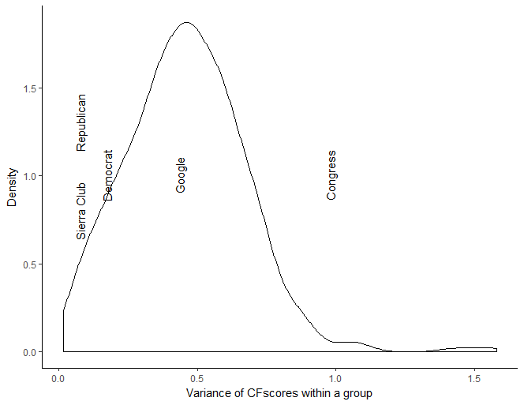
</p>

<p align="center">
  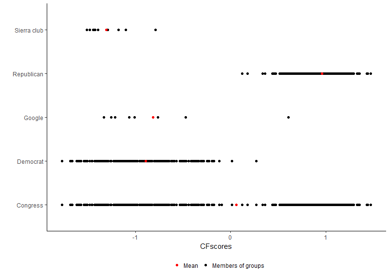
</p>


The comparison of two left-leaning groups, Google and Sierra Club's boardroom ideology, is particularly intriguing because there are big differences between their PACs' spending. As a result, Google PAC spent about \$1,039,679 in 2012 election cycle and Sierra Club spent \$2,211,965 (including independent expenditure) which is more than twice of Google PAC's spending. On the other hand, Sierra Club PAC and its independent expenditure PAC raised \$2,290,857 and Google PAC raised total \$1,850,965 in 2012 election cycle alone. It means Sierra Club PAC raised only about 23 percent more money than Google PAC, but they spent more than twice of Google PAC. It is difficult to directly compare Sierra Club's spending with Google's spending because they are two different kinds of organized interests, but they are clearly different from each other in two aspects in this paper's picture: Type of group and boardroom's diversity (internal constraints). Google is a company and Google boardroom is substantively more diverse than Sierra Club's boardroom. 

There should be more evidence to explain what is a function of PAC spending. However, my paper shows several findings and suggests questions about the relationship between interest group's PAC and their leaders. There should be further examination to understand what affects the interest group's spending. It is still unclear why some corporate PAC spending is zero, but other spend millions. It is also unclear whether certain types of groups' PAC behavior is different from others. I discussed the case of Google and Sierra Club in terms of their PAC spending and board directors. Perhaps as Li (2018) argues, these two groups' PAC donors are ideologically different and the donors as internal constraints limit PAC's behaviors (fund-raising). Or perhaps, as my paper argues, corporate PAC's board directors' ideological diversity as internal constraints within leadership also affects PAC's behavior (spending) in addition to internal constraints from the donors on fund-raising.


# Conclusion
In this paper, I investigate whether ideological diversity of corporate boards constrain the giving of corporate PACs as a part of a bigger question of why is there so little money in politics and why PACs are moderate in terms of their contribution patterns. In investigating this question, I present two main findings. First, ideologically diversity within boardroom is negatively associated with a corporate PAC's political spending. The higher the variance within boardroom, the corporate PAC as a group spends less money in politics. I explore the relationship between groups' donors, group elites, group itself and groups' money recipients. By doing so, I propose a theoretical explanation for corporate PACs' giving for moderates and spend little by internal constraints from group elites; extending Li's (2018) theory of internal constraints from donors, ideological heterogeneity within boardroom works as internal constraints among group leaders. This ideological diversity poses constraints to groups' behavior, and because of it, a group as a PAC spend less money in politics and their contribution patterns are moderates. 

Second, not all PACs are the same. The ideological composition of donors, group elites and the ideology of group itself differ considerably by types. Corporate PACs that have ideologically diverse donors and group leaders. Therefore, business PACs have moderate ideological profile in their campaign contributions. On the contrary, single-issue interest groups are more likely to have ideologically homogeneous donors and group leaders. 

This study contributes literature with a new perspective of explaining interest group's political spending and suggests a theory of "group behavior" considering group elites' ideologies and internal constraints within leaderships. It suggests that ideological diversity within corporate elites could make a hurdle for firms to spend money in politics so that it could help ordinary citizens to have equal voice and influence in politics. 

```r
require 'redcarpet'
markdown = Redcarpet.new("Hello World!")
puts markdown.to_html
```
            
