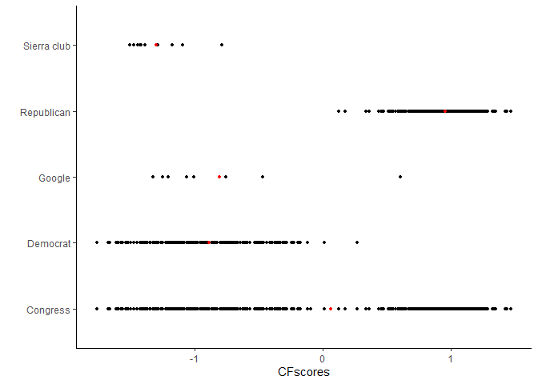
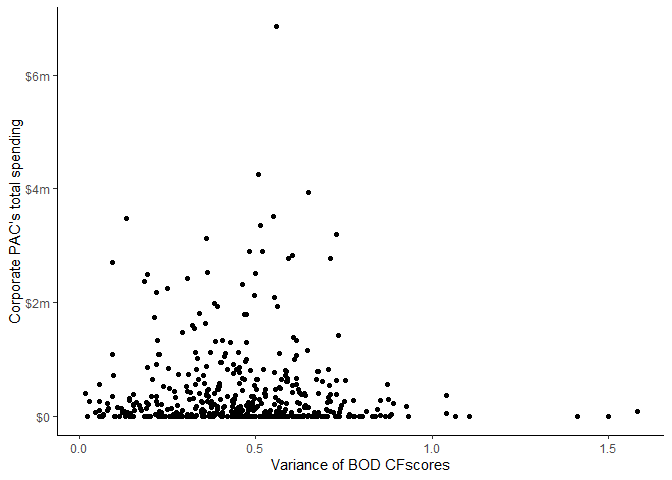

Coporate\_PAC
================
Lim
March 11, 2020


Abstract
--------

Do the ideological biases of corporate boards constrain the giving of corporate PACs? Previous literature shows that corporate PACs' board of directors are ideologically heterogeneous and PACs are strategically centrists in terms of their profile of campaign contribution. However, there is little literature on why and how corporate PACs' political spending can be constrained by corporate elites. My finding shows that the more ideologically homogeneous boardroom, the more corporate PAC spending. This finding can be explained by a theory of internal constraints in interest groups' activities in that donors of interest groups can constrain the groups' political contributions. This paper's finding suggests that corporate PACs are not only constrained by the donors but also they can be constrained by corporate elites in that the board of directors can influence PACs' amount of spending. This paper's findings can help us to better understand why there is so little money in politics and why corporate PACs are concentrated in the center of ideological spectrum.

``` r
library(ggplot2)
library(dplyr)
library(MASS)
library(pscl)

dat<-read.csv("C:/Users/wooki/Dropbox/APB/final_data2.csv",header=TRUE)


##########################################
#summary data
dat <- within(dat, {
  corp.name <- factor(corp.name)
})
```

Including Plots
---------------

You can also embed plots, for example:

    ## Warning: Groups with fewer than two data points have been dropped.

    ## Warning: Groups with fewer than two data points have been dropped.

    ## Warning: Groups with fewer than two data points have been dropped.


    ## Warning: Removed 19 rows containing non-finite values (stat_density).


    ## [1] google
    ## 496 Levels: 3m co abbott laboratories ... yum! brands inc

    ## Warning: Removed 2 rows containing missing values (geom_point).



    ## Warning: Removed 19 rows containing missing values (geom_point).


    ## Warning: Removed 19 rows containing missing values (geom_point).



``` r
m1 <- glm.nb(sum12 ~ var.dime.cfscore+sector+mean.dime.cfscore+p.female, data = dat)
summary(m1)
```

    ## 
    ## Call:
    ## glm.nb(formula = sum12 ~ var.dime.cfscore + sector + mean.dime.cfscore + 
    ##     p.female, data = dat, init.theta = 0.1157813617, link = log)
    ## 
    ## Deviance Residuals: 
    ##      Min        1Q    Median        3Q       Max  
    ## -1.94236  -1.79855  -0.30437   0.07898   1.97001  
    ## 
    ## Coefficients:
    ##                             Estimate Std. Error z value Pr(>|z|)    
    ## (Intercept)                 11.92756    0.64595  18.465  < 2e-16 ***
    ## var.dime.cfscore            -1.15735    0.68036  -1.701  0.08893 .  
    ## sectorCapital Goods          1.37532    0.73781   1.864  0.06231 .  
    ## sectorConsumer Cyclical     -0.51096    0.76101  -0.671  0.50196    
    ## sectorConsumer Goods         1.91367    2.98202   0.642  0.52104    
    ## sectorConsumer/Non-Cyclical  0.12100    0.71269   0.170  0.86518    
    ## sectorEnergy                 1.25772    0.71991   1.747  0.08063 .  
    ## sectorFinancial              1.00195    0.62625   1.600  0.10962    
    ## sectorHealthcare             1.04279    0.69274   1.505  0.13225    
    ## sectorIndustrial Goods      -1.59422    2.98074  -0.535  0.59276    
    ## sectorServices               0.24596    0.57638   0.427  0.66957    
    ## sectorTechnology             1.07165    0.65886   1.627  0.10384    
    ## sectorTransportation         2.01918    0.97791   2.065  0.03894 *  
    ## sectorUtilities              1.09395    0.71223   1.536  0.12455    
    ## mean.dime.cfscore           -0.24768    0.45677  -0.542  0.58765    
    ## p.female                     0.04222    0.01624   2.601  0.00931 ** 
    ## ---
    ## Signif. codes:  0 '***' 0.001 '**' 0.01 '*' 0.05 '.' 0.1 ' ' 1
    ## 
    ## (Dispersion parameter for Negative Binomial(0.1158) family taken to be 1)
    ## 
    ##     Null deviance: 544.34  on 444  degrees of freedom
    ## Residual deviance: 522.58  on 429  degrees of freedom
    ##   (52 observations deleted due to missingness)
    ## AIC: 9749.8
    ## 
    ## Number of Fisher Scoring iterations: 1
    ## 
    ## 
    ##               Theta:  0.11578 
    ##           Std. Err.:  0.00714 
    ## 
    ##  2 x log-likelihood:  -9715.79200
